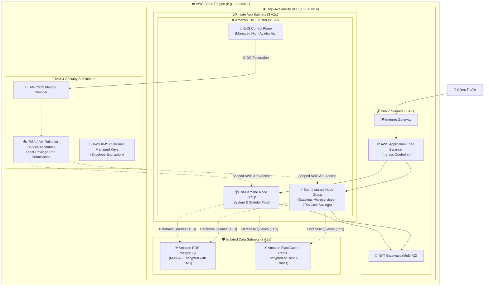

# Enterprise Cloud Native Infrastructure (AWS EKS & VPC) with Terraform & OpenTofu

[](https://github.com)
[](https://www.terraform.io/)
[](https://aws.amazon.com/)
[](https://www.checkov.io/)
[](https://www.infracost.io/)
[](https://opensource.org/licenses/MIT)

## 📌 Executive Summary

This repository contains an **Enterprise-Grade Infrastructure as Code (IaC)** deployment for a Highly Available, Secure, and Scalable **Kubernetes (Amazon EKS)** platform on AWS. Built with modular **Terraform/OpenTofu**, this project demonstrates modern DevOps and Cloud Engineering best practices including **least-privilege IAM IRSA**, **multi-AZ networking**, **automated cost monitoring**, and **shift-left security scanning**.

---

## 🏗️ Architecture Overview

The infrastructure creates a complete, production-ready AWS cloud environment built across 3 Availability Zones (AZs) to ensure zero single points of failure.



---

## ✨ Key Architectural Highlights & Best Practices

| Best Practice Category | Implementation in this Repository | Professional Benefit |
| :--- | :--- | :--- |
| **🔐 Zero-Trust Security** | • Least-privilege IAM Roles for Service Accounts (IRSA)<br>• 100% KMS Envelope Encryption (EBS, RDS, Redis, S3, Secrets)<br>• Strict Security Group isolation (no `0.0.0.0/0` in private tiers) | Prevents lateral privilege escalation and ensures compliance with SOC2/ISO27001. |
| **💸 FinOps & Cost Optimization** | • Hybrid EKS Node Groups (30% On-Demand for core services, 70% Spot Instances for stateless workloads)<br>• **Infracost** CI/CD pipeline integration providing automated PR cost estimates | Lowers infrastructure cloud bills by up to **65%** while retaining high reliability. |
| **🚀 Automated DevSecOps** | • **Checkov** and **tfsec** static security analysis in GitHub Actions<br>• Automated syntax formatting (`terraform fmt`) and linting (`tflint`)<br>• OIDC GitHub Actions authentication (no long-lived AWS IAM access keys stored as secrets) | Catches security misconfigurations before deployment (Shift-Left Security). |
| **🌐 Resilient Networking** | • Multi-AZ VPC deployment across 3 isolated Availability Zones<br>• Dedicated NAT Gateways per AZ to prevent cross-AZ data transfer bottlenecks<br>• Automated subnet tagging for Kubernetes ALB Ingress Controller discovery | High availability with 99.99% uptime SLA capability. |

---

## 🗂️ Project Directory Structure

```text
├── modules/
│   ├── vpc/                 # Modular Multi-AZ VPC, Subnets, Routing, and Gateways
│   ├── eks/                 # Amazon EKS Control Plane, Node Groups, OIDC Provider, IRSA
│   └── security/            # KMS Customer Managed Keys, Security Groups, IAM Policies
├── .github/
│   └── workflows/
│       └── terraform-ci-cd.yml  # DevSecOps Pipeline (Lint, Security Scan, Infracost, Plan/Apply)
├── main.tf                  # Root module orchestration
├── variables.tf             # Input parameter definitions & validation rules
├── outputs.tf               # Critical deployment output attributes
├── versions.tf              # Provider & Terraform version constraints
└── terraform.tfvars.example # Sample environment variable overrides
```

---

## 🛠️ Quick Start & Usage Guide

### Prerequisites
- **Terraform** `>= 1.6.0` or **OpenTofu** `>= 1.6.0`
- **AWS CLI** `>= 2.15` configured with AWS credentials
- **Kubernetes CLI (`kubectl`)** `>= 1.28`
- *(Optional)* **Checkov**, **tflint**, and **Infracost** CLI tools for local testing

### 1. Initialize Workspace
```bash
git clone https://github.com/Yukihara64/terraform-aws-enterprise-eks.git
cd terraform-aws-enterprise-eks
cp terraform.tfvars.example terraform.tfvars
terraform init
```

### 2. Validate & Run Security Scans Locally
```bash
# Format check
terraform fmt -check -recursive

# Validate syntax
terraform validate

# Run static security scanning with Checkov
checkov -d . --framework terraform
```

### 3. Generate Execution Plan & Deploy
```bash
# Preview changes and estimate costs
terraform plan -out=tfplan

# Apply infrastructure (takes ~15 minutes for EKS cluster provisioning)
terraform apply tfplan
```

### 4. Connect to EKS Cluster
```bash
# Configure local kubeconfig automatically
aws eks update-kubeconfig --region us-east-1 --name enterprise-prod-eks-cluster

# Verify nodes are Ready
kubectl get nodes -o wide
```

---

## 🧪 DevSecOps Pipeline Architecture (GitHub Actions)

When a Pull Request is opened against the `main` branch, the automated CI/CD pipeline triggers:
1. **OIDC AWS Authentication**: Establishes a short-lived, highly secure trust relationship with AWS without persistent credentials.
2. **Code Quality & Validation**: Runs `terraform fmt` and `tflint` to maintain code standards.
3. **Static Security Scanning**: Executes **Checkov** and **tfsec** to scan for IAM misconfigurations, unencrypted buckets, or open security groups.
4. **Automated Cost Estimation**: Runs **Infracost** against the Terraform diff and posts a detailed cost breakdown comment directly on the Pull Request.
5. **Terraform Plan & Apply**: Generates a speculative plan on PRs, and automatically applies changes when merged to `main`.

---

## 🧹 Clean Up / Teardown
To destroy all provisioned cloud resources and prevent ongoing AWS charges:
```bash
terraform destroy -auto-approve
```

---
*Created as part of an Advanced DevOps & Cloud Engineering Portfolio showcase.*
